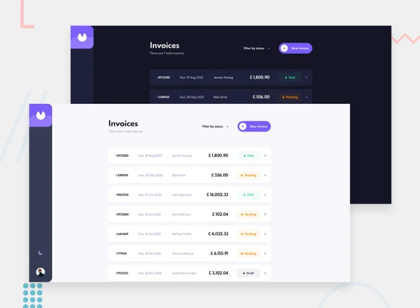

# Invoice App

- Full responsive Invoice App
- CSR rendering implemented using React.js
- No Database. everything save on FrontEnd

## Option
- Dark Mode
- Create, Delete & Edit Invoices
- Notification on actions
- Set Invoice as Paid
- Validation on Edit and Create Invoice
- Sort Invoice by:
    - status
    - payment
    - client's name
    - date

## Run Project
### `npm install`
Install all packages used in app

### `npm start`
Runs the app in the development mode.
Open [http://localhost:3000](http://localhost:3000) to view it in your browser.

## Project Status
Completed

